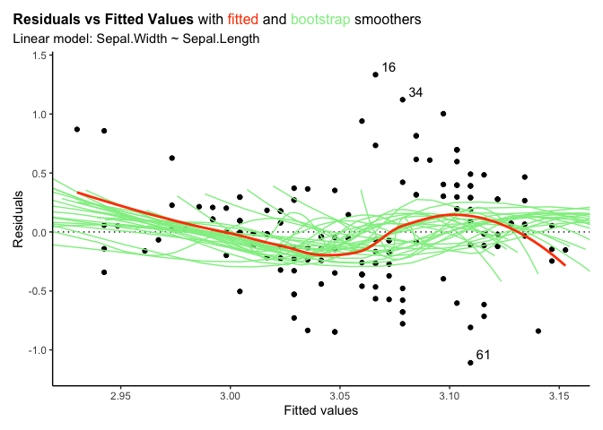
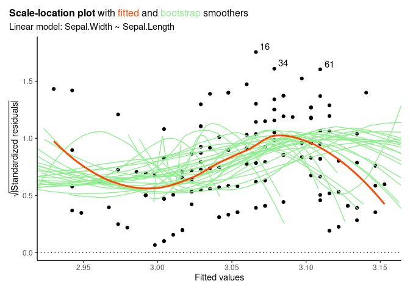
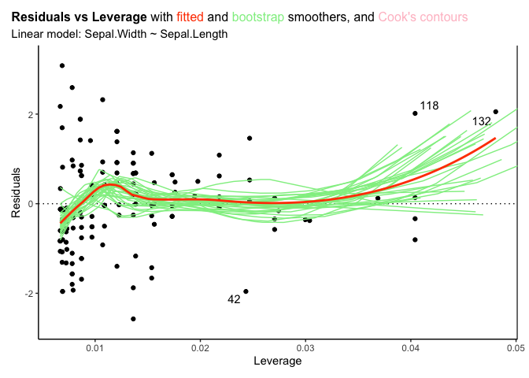

<!-- README.md is generated from README.Rmd. Please edit that file -->

# iNZightRegression

<!-- badges: start -->


[](https://codecov.io/github/iNZightVIT/iNZightRegression?branch=master)
[](http://www.gnu.org/licenses/gpl-3.0)
[](https://CRAN.R-project.org/package=iNZightRegression)

<!-- badges: end -->

An R package which provides summary information and plots which have
been altered from those provided by base R.

It now handles `glm` object, as well as `svyglm` objects from the
`survey` package.

## Installation

You can install the released version of iNZightRegression from
[CRAN](https://CRAN.R-project.org) with:

```r
# Not yet on CRAN - please use devtools below
# install.packages("iNZightRegression")
```

And the development version from [GitHub](https://github.com/) with:

```r
# install.packages("devtools")
devtools::install_github("iNZightVIT/iNZightRegression")
```

## Example

Plots and summaries of model objects:

```r
library(iNZightRegression)
#> *****************************************************************
#> * Loaded iNZightRegression                                      *
#> *                                                               *
#> * Methods imported from 'iNZightPlots':                         *
#> * - use `inzplot()` for diagnostic plots of model objects       *
#> * - use `inzsummary()` for a summary of model objects           *
#> *****************************************************************
iris.lm <- lm(Sepal.Width ~ Sepal.Length, data = iris)

set.seed(246) # for bootstrap smoothers
inzplot(iris.lm, which = "residual")
```



```r
inzplot(iris.lm, which = "scale")
```



```r
inzplot(iris.lm, which = "leverage")
```



```r

inzsummary(iris.lm)
#>
#> Model for: Sepal.Width
#>
#> Coefficients:
#>                Estimate Std. Error    t value  p-value      2.5 %  97.5 %
#> (Intercept)   3.419e+00  2.536e-01  1.348e+01 <2e-16   ***  2.918 3.92002
#> Sepal.Length -6.188e-02  4.297e-02 -1.440e+00  0.152       -0.147 0.02302
#> ---
#> Signif. codes:  0 '***' 0.001 '**' 0.01 '*' 0.05 '.' 0.1 ' ' 1
#>
#> Residual standard error: 0.4343 on 148 degrees of freedom
#> Multiple R-squared: 0.01382, Adjusted R-squared: 0.007159
```
